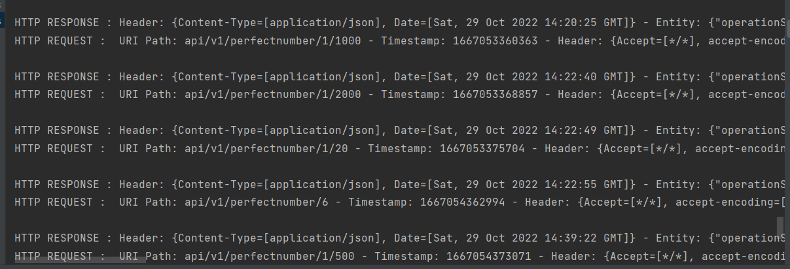
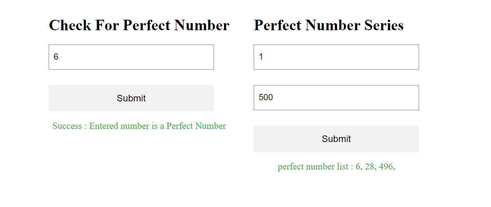

Here is some special points of the development 

1) Embedded Jetty server
For the embedded server I have choose CXFNonSpringJaxrsServlet as a servlet from apache cfx. Because it is using singleton scope by default and that can be used to 
attach our resource classes in to it when the Jetty server is starting.

2) I have handle the request inside the controller with returning the 
correct error codes and response codes with the json response 

3) For the controller used GET apis with swagger api doc. 
I have centralized all the requests and responses to log everytime using ContainerResponseFilter and ContainerRequestFilter interfaces. 
I haven't centralized the exception logging because to maintain the readability. Here is the image of req resp logged.

4) NumberResponseMapper class use to return the detail response including messages and perfect number series and etc. It is useful when populating the json data in front end app.

5) For the security i have selected the basic auth for now because of the 
time issue occurred for the task. I should change it to google Auth2 which the best security as of my knowledge

6) For the unit test Junit Jupiter latest is used.

7) I have created a small react UI with the GET rest calls to get 
the perfect numbers as follows. Before creating the React UI i have used postman to 
check the api responses
`

8) I have created the Rest Assured project to integration test and it is calling the rest apis 
and getting the responses as follows. git hub link - https://github.com/chaturathilanka/perfect-number-integration-test

To run and do the local communication between back end and front end react UI CORS(disable security) policy must be disabled for the particular browser

The command to disable security is as follows 

`"C:\folder path to chrome exe\chrome.exe" --disable-web-security --user-data-dir=C:\path to new browser instance with disabled security

